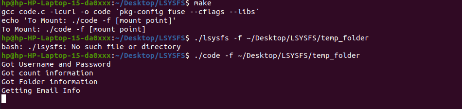
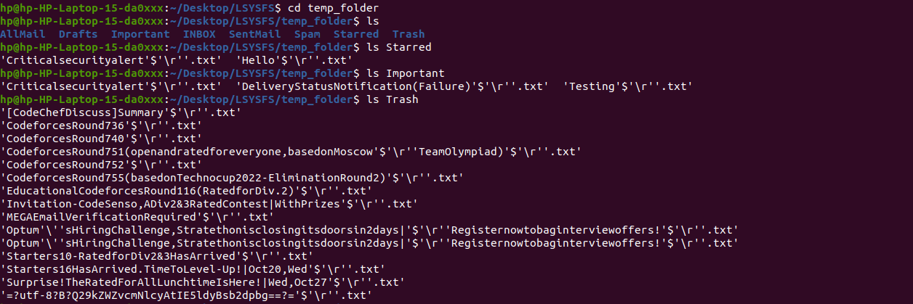

# CS-303 Assignment 5

=================================

Submitter name: Preetesh Verma

Roll No.:2018eeb1171

Course:Operating System

=================================


## Problem Statement

As part of this assignment we were asked to implement a program in C on linux that implements a FUSE based file system that works as follows:
1. Treats an email account as the “storage disk” when reading, writing, listing, creating and
deleting “files”.

2. An email message in the account represents a “file”. 

3. The folders or labels in the email account can represent the “directories”.

4. You can assume that the depth of the file path is only one level. 


The problem statement therefore had the following main components:
1. Connecting to remote email server
2. Getting Email Folders,Mailboxes,Subjects and Contents
3. Implementing FUSE and mounting remote account on local directory
4. Implementing various commands for file manipulation

The problem asked us to create a File System and to use a mail account as second storage disk for the same. The emails in that need to act as the files and the subjects of these emails as the file names. The mailboxes would serve as the directories of the File system and we need to mount this email account onto a local folder and then be able to perform operations such as "ls","cd","mv","mkdir",etc. on these files and folders which would also refect changes on the secondary storage side i.e. the mail server side.

## Approach to Solution
### Overview

As part of the solution, First I take in all the necessary arguments and then connect to remote email server and then make requests about the email folders and email subjects present in the folders.Then I add them into the data structure matrices and thereafter FUSE implementation which allows me to do some functions.
After that I implemented the commands:
1. cd
2. ls
3. mkdir
4. rmdir
5. rename
6. mknod
7. read

The read function only works for the files that are created right now since I am unable to parse the body of the mail from the email server.This file could be opened in gedit as well to see the contents.
The cd function helps us move up and down the directory tree.
The ls function lists all the directories and the files present.
The mkdir creates a new label for the email account.
The rmdir removes the created label.The fixed folders cannot be re-labelled or deleted.
The mknod/ echo function creates a file and is implemented by sending email in the email account and can also be seen in the sent folder.
I was not able to bring the content of the mail into files although I tried alot and code can be seen in the body.c folder.
### Directory Structure

```

|-- README.md
|-- code.c
|-- code_list.c
|-- body.c
|-- folder.txt
|-- output.txt
|-- Readme.pdf
|-- images
|-- |-- figure.png..

```

### Detailed Explanation of the solution and contents of each file

### code.c

This is the main file which contains the code.First in the main function I am taking the username and password from the config file provided.Then I am also getting the information about various mailboxes present in the email account and then getting the names of these folders, labels present in the mailbox.
Then based on the previous information fetching the email contents of these folders and storing them in the string matrices.

After that the fuse part begins.
```
static struct fuse_operations operations = {
    .getattr	= do_getattr,
    .readdir	= do_readdir,
    .read		= do_read,
    .mkdir		= do_mkdir,
    .mknod		= do_mknod,
    .write		= do_write,
	.rmdir		= do_rmdir,
    .rename     = do_mv,
    .unlink     = do_unlink,
};
 
```
The above mentioned functions have been implemented by me.

The function of getattr event will be called when the system tries to get the attributes of the file.
The function of readdir event will be called when the user tries to show the files and directories that reside in a specific directory. 
The read function when we want to read the content present inside a file.
The mkdir function when we want to create a new directory.
The mknod function when we want to create a new file.
The write function when we want to write to a file.
The rmdir funtion when we want to delete a folder
The rename function to rename a directory
The unlink function to unlink if a link is established in files.

For implementing these function some helper functions are written.

I had attempted to create a struct and then implement these functions but due to string parsing issues and limited time I could not implement it.
Certain commonly used functions are not present in the fuse library so have not been implemented.

Note -- In order to close the execution you need to press Ctrl+C.
Note -- Create Congig.txt by creating a simple .txt file and entering the Host name, Port number, email ID and Password in it.Then in the code.c file enter it's path in line 1304 at the place of Config.txt.
Note -- As far as giving the config file as input argument is considered, it was not possible since FUSE does not permit it.Fuse main also takes in the argc and argv arguments and so it was showing error when doing that.So user needs to give the path for the same.
### code_list.c
This is a helper which contains the code which helps us in getting different and vital information regarind the various mailboxes and labels present in the mail account.Just like the code.c file here also we need to provide the path of the config file.

```
gcc code_list.c -lcurl -o check
./check config.txt
```

### body.c

This code shows my attempt to get the body of the email for various folders.The issue I faced was how to save these strings due to their enormous size.

```
gcc body.c -lcurl -o body
./body config.txt
```

## Procedure to run the files

To run the solution only one file needs to run.
code.c is the file containing the entire codebase.

Commands to compile and run the code.c and a standard argument list which could be changed by the user are provided below.

```
make
./code -f ~/Desktop/LSYSFS/temp_folder
```

Then the code starts outputting the various stages it is in like(This might few minutes):

```
Got Username and Password
Got count information
Got Folder information
Getting Email Info
Getting Email Info
Getting Email Info
LOADING FILES

```
Now you can open another terminal and move to the mount point, and start giving commands such as 

```
ls
ls INBOX
ls SentMail
ls Important
mkdir dir0
ls
mv dir0 dir1
ls
rmdir dir0
echo Hello World >>file0.txt
head file0.txt

```
To stop the code just press Ctrl+C.

### Snapshots of the results

Main program asking for arguments


Main program running



A small demo video can be found in the images folder.

# References 

*   https://curl.se/libcurl/c/example.html
*   https://github.com/MaaSTaaR/SSFS
*   https://github.com/MaaSTaaR/LSYSFS
*   https://www.geeksforgeeks.org/implement-itoa/
*   https://www.cs.hmc.edu/~geoff/classes/hmc.cs135.201001/homework/fuse/fuse_doc.html


A major portion of code has been inspired from the https://github.com/MaaSTaaR/LSYSFS repository for implementing FUSE. Functions of getattr and read_dir are made on same lines.
This repo serves as a template for writing FUSE code.
All the libcurl related code is used from the Libcurl API examples page.
I understood the FUSE implementation from this site https://www.maastaar.net/fuse/linux/filesystem/c/2019/09/28/writing-less-simple-yet-stupid-filesystem-using-FUSE-in-C/