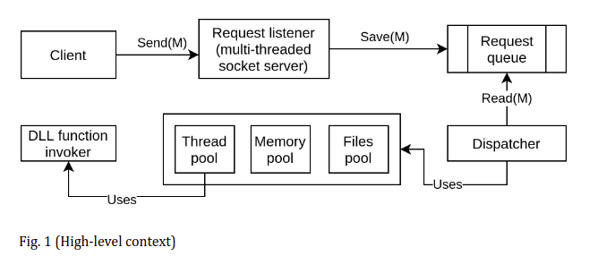
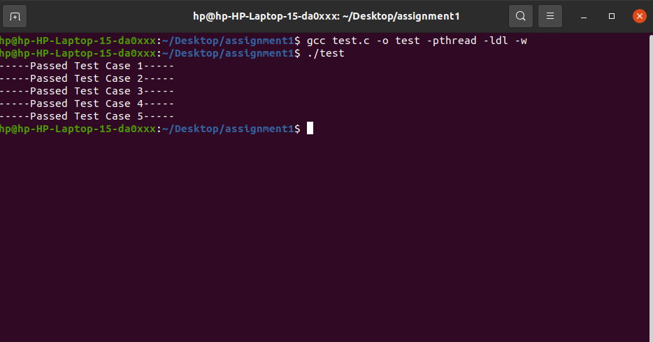
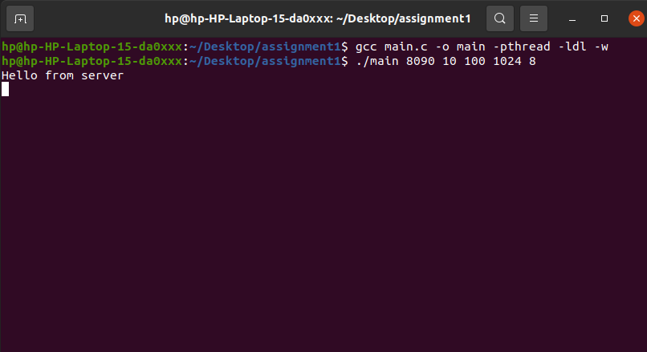
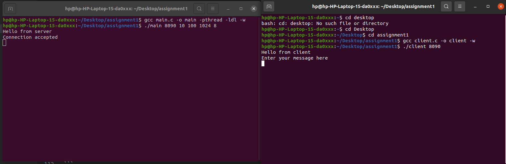
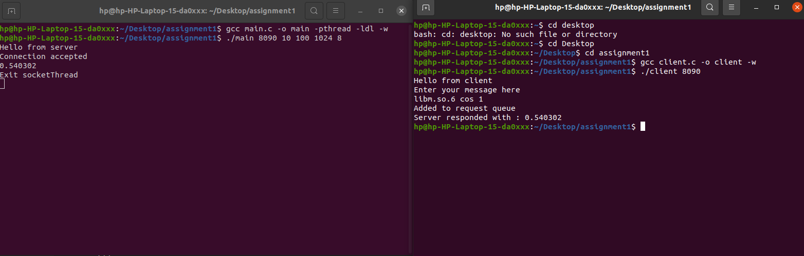
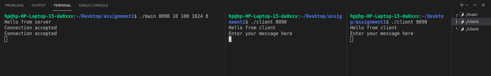
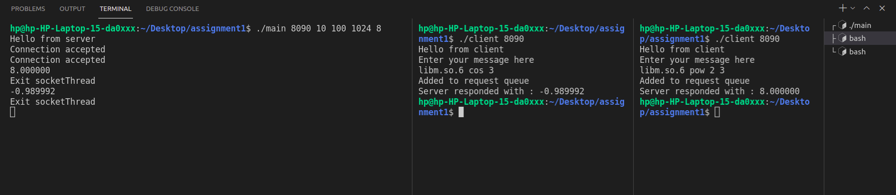

# CS-303 Assignment 1

=================================

Submitter name: Preetesh Verma

Roll No.:2018eeb1171

Course:Operating System

=================================


## Problem Statement

As part of this assignment we were asked to implement a program that mimics how processes are managed by the dispatcher in an OS. The high-level structure of the program is shown in Fig. 1 below. The program has to be developed in C programming language on a linux OS.



The problem statement had the following main components:
1. Request Listener
2. Request Queue
3. Dispatcher
4. Dynamically loaded library (DLL) function invoker

Thus, the problem statement asked us to create a multithreaded TCP server/client socket where the clients would send requests to the server and the server would receive the requests on independent threads and these threads would place these request in request queue from where an independent set of threads would take on these requests and call the DLL function invocator and compute the result as per the request sent(Here we need to take care of race condition amongst the threads and also the memory and space utilization by them). Since we were not provided by any specifics in the question regarding what functions to call, we have the freedom to select a group of functions and design our code accordingly.


## Approach to Solution

### Overview
As part of the solution I first implemented a multithreaded TCP client/server socket using the ```<sys/socket.h>``` library for socket programming and ```<pthread.h>``` library for multithreading. 

Then I implemented the request queue using Linked List where the accepted incoming requests from clients would be placed by server connection threads and a different set of threads(Thread Pool) would take to execute the task. Thread pool is a set of pre-derived threads, and then an administrator to manage and schedule these threads, you just need to constantly give him the task to complete, he will schedule the resources of the thread to help you complete. 
The administrator has to manage a task queue and add tasks to the end of the queue if new tasks are received. Each thread stares at the queue. If the queue is not empty, it takes a task to process at the head of the queue (each task can only be taken by one thread). After processing, it goes on to the queue to fetch the task. If there are no tasks, the thread will sleep until the task queue is not empty. 
The task here is DLL invocation. The new set of threads would run the tasks through the Dynamic Library function invocator and print the output on the terminal and also return back to the client and close the corresponding connection.

### Directory Structure

```

|-- README.md
|-- client.c
|-- main.c
|-- server.c
|-- test.c
|-- Readme.pdf
|-- README.md
|-- images
|-- |-- figure.png..

```

### Detailed Explanation of the solution and contents of each file

### main.c

This is the main file which starts the server. The file takes the following arguments upon execution and if not provided the server would not start.

1. PORT NUMBER --- The port on which the server would run.
2. MAX THREAD COUNT --- The maximum threads in thread pool. 
3. MAX CLIENT COUNT --- Maximum number of clients that server could connect to.
4. FILE COUNT --- Maximum number of files that a thread could open.
5. MEMORY LIMIT --- Maximum amount of memory a thread could access.

Upon receiving the above mentioned arguments the programs start the server by invoking the run function from server.c file.
 
### server.c

This is the file where the code for starting the server side socket is written. Upon invocation by main.c, the function run() starts executing where the implementation of multithreaded TCP socket is written and also the creation of thread pool. The server once started would continuously listen for clients and upon connecting would spawn a new thread to encounter the operations of that client and place the received query into the Request Queue.The server shall take only one task per client and for giving multiple tasks multiple connections have to be invoked with the server. To make sure of file and memory limits are met  getrlimit() and setrlimit() system calls were used.The get and set resource limits.Each resource has an associated soft and hard limit,as defined by the rlimit structure:

	struct rlimit {
		rlim_t rlim_cur;  /* Soft limit */
		rlim_t rlim_max;  /* Hard limit (ceiling for rlim_cur) */
	};

The  soft  limit  is  the value that the kernel enforces for the corresponding resource.  The hard limit acts  as  a  ceiling  for  the  soft limit:  an  unprivileged process may set only its soft limit to a value in the range from 0 up to the hard limit, and (irreversibly) lower its hard limit. 

The thread pool created would be waiting for the queue to be not empty and soon as the conditional variable (using pthread API) indicates so one of the threads in the thread pool would take up the task.(Race Condition is avoided by making this critical section and locking the queue during the process.) If ever the number of clients who are requesting to connect to the server then the server would simply not accept the connection and destroy that particular connection till any of the previous connections terminate.The connection would not accepted into the queue as well.Otherwise in normal scenario after inclusion of the task in queue an acknowledgment is sent to the client as "Added to request queue".

The threads would then invoke the DLL function using the ```<dlfcn.h>``` library and run the concerned request.Once the request is passed and DLL function invoked the results are printed on the terminal and the connection between the client and socket is terminated and the thread goes back to looking for new tasks on the request queue. The program was tested and found to be capable to take multiple threads together till they are within the limit of argument passed.

Since the data type of functions is not taken as input, we would be implementing a selected library for a few functions of the same data type.

For my program the following combination has been selected by me.

```
Library ---libm.so.6

Functions ---cos,sin,tan,pow,log,atan2f etc.
```
(Arguments ---depends on functions.)

Note-- If the number of clients exceeds the clients count passed as argument to the server then the server shall not accept the request and just send a junk output and immediately terminate the connection with that client.

### client.c

This code needs to run to simulate a client who wants to connect to the server. Before running it the server has to be running. The program only takes one argument, the PORT NUMBER which needs to be the same as the server. The client must provide the following structure as requested by the server.

Note -- In order to close a running server or client you need to press Ctrl+C.
```

struct request {
	char* dll_name; // Name of a dynamically loaded library
	char* func_name; // Name of a function to call from the DLL
	char** func_args; // Arguments to pass to the function
};
 
 ```
 I have used 'white space' as delimeter to seperate between the three entities.

### test.c

This is the file contating the unit tests written by me to test the functions.
The tests check the working of the queue functions,multithreading functions and the DLL function invocator.
The test cases basically run tests on Queue operations such as Enqueue and Dequeue.
The proper evaluation of DLL and the creation of multiple threads (1000) for checking the multithreading functions.
The use of pthread library to create threads.

## Procedure to run the files

To run the solution only two files need to run.
Main.c to start the server and client.c to call the client.

Commands to compile and run the main.c and a standard argument list which could be changed by user are provided below.

```
gcc main.c -o main -pthread -ldl -w
./main 8090 10 100 1024 8
```

Commands to start the client.We could have multiple clients running simultaneously.

```
gcc client.c -o client -w
./client 8090
```
Then provide the string such as forfunction such as cos,tan,sin,pow,log,atan2f and their arguments.
```
libm.so.6 cos 21

```
Commands to run the unit test file code

```
gcc test.c -o test -pthread -ldl -w
./test
```



### Snapshots of the results

Server getting started and listening for incoming requests


Client and server forming a connection


Client sent a request, a thread on server added the request to queue and sent acknowledgement of the same and then one of the thread pool threads executed the DLL task and printed the result on server terminal and also returned it to the client.


Multiple client request being accepted by the server and answering their queries respectively





A small demo video can be found in the images folder.

## References
https://www.geeksforgeeks.org/multithreading-c-2/
https://tldp.org/HOWTO/Program-Library-HOWTO/dl-libraries.html
https://www.geeksforgeeks.org/socket-programming-cc/