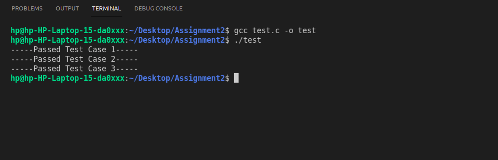
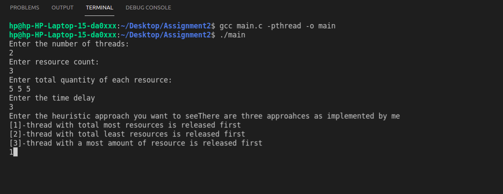
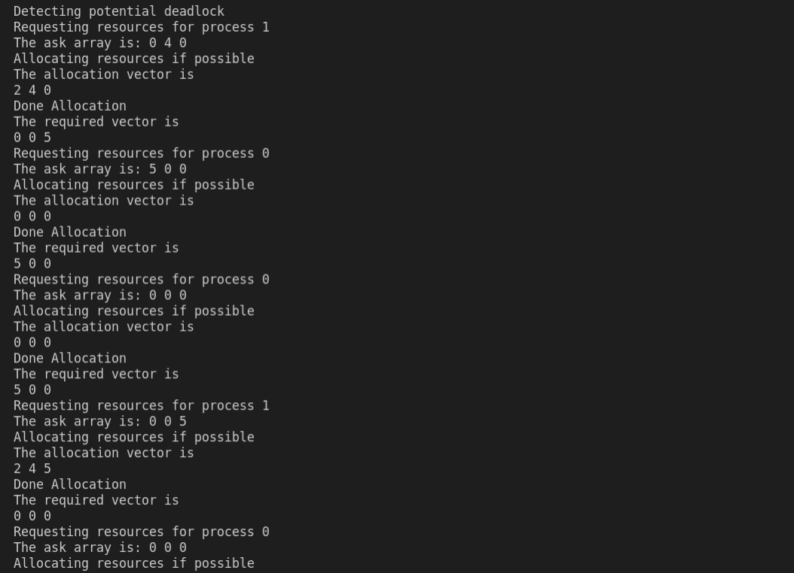
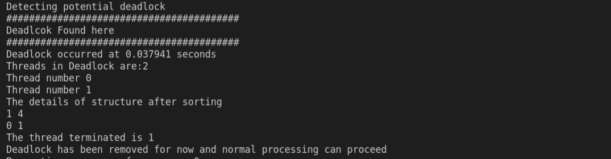
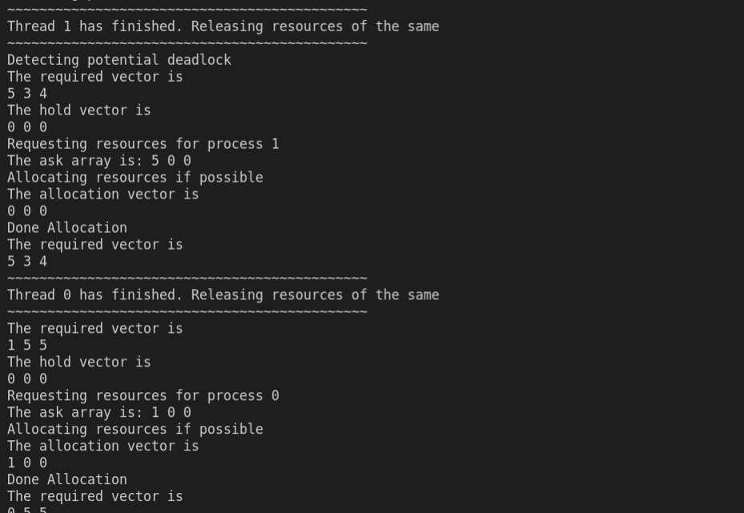

# CS-303 Assignment 2

=================================

Submitter name: Preetesh Verma

Roll No.:2018eeb1171

Course:Operating System

=================================


## Problem Statement

As part of this assignment we were asked to implement a program that mimics how deadlocks occur and are detected in an OS.The program simply creates situations where it is very likely for the system to get into a deadlock and then the deadlock needs to be detected and some action takes place to remove it. The program has to be developed in C programming language on a linux OS.

The problem statement had the following main components:
1. Thread Process Simulator
2. Request Generator
3. Allocator
4. Deadlock Detection and Termination of Thread if necessary

Thus, the problem statement asked us to create a thread pool where each of these threads would randomly be asking for random resources with a certain amount of pauses between the requests.This would lead to deadlocks being occuring and then on an another thread an infinte running algorithm to detect the Deadlock is functioning which after every 'd' seconds checks for potential deadlocks in the system.

If the deadlock is not found then the threads work normally till they have acquired all the resources that they need and after this they randomly generate a new request after releasing all their resources.If a deadlock is found then the algorithm needs to terminate a few threads based on different kind of metrics and release their resources and spawn new threads in their place and the thread start functioning again. It's an infinitely running program.

## Approach to Solution

### Overview
As part of the solution I have used the ```<pthread.h>``` library for multithreading. 

First I created all the necessary vectors and matrices necessary to keep a track of the allocated resources and the required resources for each of the threads.Then after implementing the thread pool each of these threads would run parallely and randomly request for locks (mutual exclusion) on these above created data structures and if acquired then would genrate random requests of resources with a ceratin amount of pause between sucessive requests.

If the asked amount of resources are currently available then system will allocate them to the threads or else simply ask the thread to ask for another request.If a thread is allocated all that it wanted then it simply releases its resources and then makes a new request for resources.

In parallel to these threads, there is another thread which is also running infintely and simply looks for potential deadlocks in these threads after every d seconds.If deadlock is found then the threads are arranged according to current heuristics and threads are beeing terminated and the resources which they held are released which would remove the potential deadlock. 
I have implemented three type of heuristics:

[1]-thread with total most resources is released first
[2]-thread with total least resources is released first
[3]-thread with a most amount of resource is released first 

From the results observed the first heuristic performs the best as the time between the deadlocks is most and the number of threads terminated is least.

The third one does the second best and its quite logical as well since in a majority of cases the threads which holds the single largest value of a resource also generally contains the largest sum.

The second one is not very good performing as the deadlocks occur quite frequently.

### Directory Structure

```

|-- README.md
|-- main.c
|-- test.c
|-- Readme.pdf
|-- images
|-- |-- figure.png..

```

### Detailed Explanation of the solution and contents of each file

### main.c

This is the main file which starts the program. The file takes the following arguments upon execution and if not provided the server would not start.

1. The number threads in thread pool.
2. Types of Resouces
3. Maximum number of instances of each resource
4. Time Delay
5. Heuristic Approach

Upon receiving the above mentioned arguments the programs starts by creating the resource allocation matrix and the requirement vectors for each of the threads.
Each of threads created in the thread pool then parallely start their execution trying to acquire locks on these vectors.If acquired the locks the threads generate resource requests by passing a random value less than the need for the thread as a request for each of the resource.Implementation of Allocation of resources to the thread which will only happen if there are enough resources available to be allocated to that process else no resources are allocated for that resource to that thread.
It is checked if the asked amount is available or not and is needed by that resource or not or if it has already acquired that much amount of resource through prior request.

The deadlock checker function is responsible for checking for any potential deadlock among the threads by seeing the matrix and the requirements of the threads.Then based on heursitics threads are terminated.
Remove the resources held by these threads in threads_in_deadlock and then check if deadlock is removed

1. if removed then resume the normal processing of the threads.
2. continue releasing resources from the threads.

Implementing the heuristics as requested by the user
The purpose of this node is to help in applying different types of heuristics to the threads in deciding which thread to terminate.
```

struct Node {
	int thread; // Name of a dynamically loaded library
	int resources; // Name of a function to call from the DLL
};
 
```

Sort the structure in decreasing order of resources each thread in the deadlock holds the resources.
Sort the structure in increasing order of resources each thread in the deadlock holds the resources.
Sort the structure in decreasing order of single largest amount of resource each thread in the deadlock holds.
Results from the heuristics are:
1. From the results observed the first heuristic performs the best as the time between the deadlocks is most and the number of threads terminated is least.
2. The third one does the second best and its quite logical as well since in a majority of cases the threads which hold the single largest value of a resource also generally contains the largest sum.
3. The second one is not very good performing as the deadlocks occur quite frequently.

On average the number of deadlocks in the first and the third were taking more time then the third one and since resource allocation was based on random function so it is not possible to exactly quantitatively compare the time of the two.The number of threads released was the least in the top one then the third one and then second one.

Note -- In order to close the execution you need to press Ctrl+C.


### test.c

This is the file contating the unit tests written by me to test the functions.
The tests check the working of the heuristic,multithreading functions.
The test cases basically run tests on heuristic operations such as sorting.
The random generation of request for each type of resource.
Proper allocation of items to a request if available.
The use of pthread library to create threads.

## Procedure to run the files

To run the solution only one file needs to run.
main.c is the file containing the entire codebase.

Commands to compile and run the main.c and a standard argument list which could be changed by the user are provided below.

```
gcc main.c -pthread -o main 
./main
```

Then provide the arguments as needed by the funtion.

```
Enter the number of threads:
2
Enter resource count:
3
Enter total quantity of each resource:
5 5 5
Enter the time delay 
3
Enter the heuristic approach you want to see There are three approahces as implemented by me
[1]-thread with total most resources is released first
[2]-thread with total least resources is released first
[3]-thread with a most amount of resource is released first
1
```

Commands to run the unit test file code

```
gcc test.c -o test
./test
```




### Snapshots of the results

Main program asking for arguments


Main program running


Deadlock detected and thread terminated


Threads received all the resources and now released their resources.



A small demo video can be found in the images folder.

## References
https://www.geeksforgeeks.org/multithreading-c-2/