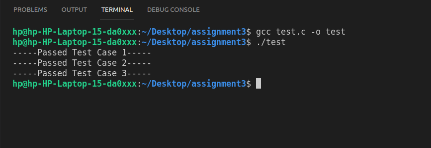
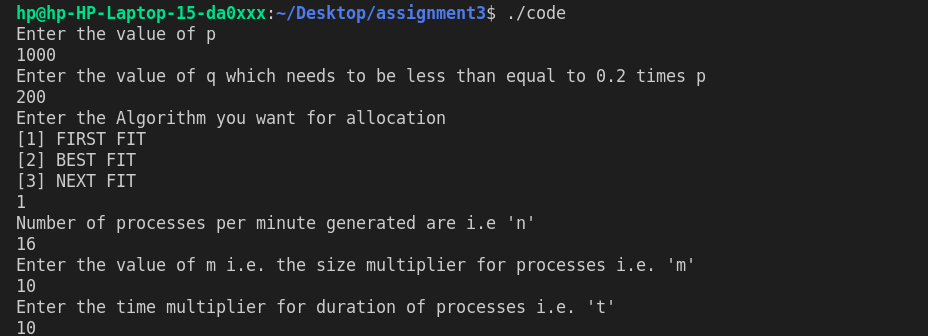
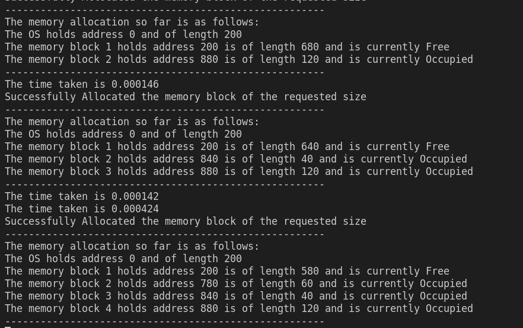

# CS-303 Assignment 3

=================================

Submitter name: Preetesh Verma

Roll No.:2018eeb1171

Course:Operating System

=================================


## Problem Statement

As part of this assignment we were asked to implement a program to investigate the relative effectiveness of the first-fit, best-fit, and next-fit algorithms for dynamic partitioning based memory placement. The program should measure the following performance metrics for the above mentioned placement algorithms:
1. Memory utilization (%age of the total physical memory actually used)
2. Average turnaround time. The turnaround time is the time it takes for successfully allocating the requested amount of memory to a process.

The problem statement had the following main components:
1. Memory block simulator
2. Request Generator
3. Memory Request Allocator Based on the type of Algorithm
4. Free space after the process time duration has expired

Thus, the problem statement asked us to create a code where we try to mimic the situation of dynamic memory allocation. We had to implement all the three algorithms and then compare their performances. The request for the memory blocks by the different processes has to be random and needs to be First Come and First Server basis i.e. the process that was created earlier needs to be allocated the space first and then the future ones.Then after the process has been allocated the memory it demanded and has spent the time it had to be spent with that memory, the resources are released and that particular block becomes free and is merged with other free memory blocks.

## Approach to Solution

### Overview

As part of the solution, First I take in all the necessary arguments and then create a memory block of the specified size and also save a chunk of space for the OS related part. I have linked list for simulating the memory blocks. Then I initialized as rest of the space as free.After that I take in other vital arguments such as Number of processes, Algorithms, Size of the processes, their duration and the number of processes been created per minute.
After that I implemented the algorithms:

1. First Fit
2. Best Fit
3. Next Fit

While memory allocation by any of these algorithms if the space is available then the block is allocated that much space and if not then it is inserted into a waiting queue where it needs to wait till we have sufficient space for it(FIFO). Also while allocation we constantly look for processes which are done with their duration and are ready to be released. If found such a process we release its resources and set the state of that memory space as free and merge it with either the next or the previous blocks.

The results in the form of tables at the bottom of the page.

### Directory Structure

```

|-- README.md
|-- code.c
|-- test.c
|-- Readme.pdf
|-- images
|-- |-- figure.png..

```

### Detailed Explanation of the solution and contents of each file

### code.c

This is the main file which starts the program. The file takes the following arguments upon execution and if not provided the server would not start.

1. The total memory block.
2. Size in block that is reserved for OS
3. Algorithm
4. Number of processes generated per minute
5. Size of processes
6. Duration of processes

Upon receiving the above mentioned arguments the programs starts by creating the memory blocks and initializing the space for OS and marking the rest of the space as free.
For the memory blocks each partition has been implemented as a linked list with the following structures.
```

struct node {
    int addr;           // Starting address of the block
    int length;         // The length of the block
    int num;            // Count of the block;
    int state;          // Whether the memory block is free or held
    int duration;       // Time for which the memory is blocked by the thread
    clock_t time_value; // To store the time part of the question
    struct node *prev;  // For linking the previous node in the memory chain
    struct node *next;  // For linking the next node in the memory chain
};
 
```

Now request generator would create a random request with a time and size limit and depending upon the algorithm decided it would be passes to it.Now there are two scenarios:

1. Enough space available for the process and so it is allocated.
2. Not enough is free so it is added to a waiting queue.

Then there is a memory freeing function which simply checks for every non free block if the process currently occupying its block has lived its duration. If yes then it is released and marked as free and merged if the prev or next blocks are also free.

Note -- In order to close the execution you need to press Ctrl+C.


### test.c

This is the file contating the unit tests written by me to test the functions.
The tests check the working of the queue and the other functions written by me.
Proper enqueuing and dequeuing of the elements from the queue and also the three algorithms as well.


## Procedure to run the files

To run the solution only one file needs to run.
code.c is the file containing the entire codebase.

Commands to compile and run the code.c and a standard argument list which could be changed by the user are provided below.

```
gcc code.c -o code 
./code
```

Then provide the arguments as needed by the funtion.

```
Enter the value of p
1000
Enter the value of q which needs to be less than equal to 0.2 times p
200
Enter the Algorithm you want for allocation
[1] FIRST FIT
[2] BEST FIT
[3] NEXT FIT
1
Number of processes per minute generated are
10
Enter the value of m i.e. the size multiplier for processes
4
Enter the time multiplier for duration of processes
2
```

Commands to run the unit test file code

```
gcc test.c -o test
./test
```




### Snapshots of the results

Main program asking for arguments


Main program running



A small demo video can be found in the images folder.

# Results
For First Fit:

CASE1:

| p | q | n | m | t |Memory   | Time  |                                       
|---|---|---|---|---|---|---|
|1000 |200   |10   |10   |10   |72.5%   |0.000022   |
|2000 |200   |10   |10   |10   |48.5%   |0.000016   |
|3000 |200   |10   |10   |10   |23.4%   |0.000020   |
|4000 |200   |10   |10   |10   |19.75%  |0.000016   |
|5000 |200   |10   |10   |10   |15.6%   |0.000014   |
|6000 |200   |10   |10   |10   |11.8%   |0.000015   |
|7000 |200   |10   |10   |10   |9.8%    |0.000014   |
|8000 |200   |10   |10   |10   |7.5%    |0.000013   |


CASE2:

| p | q | n | m | t |Memory   | Time  |                                       
|---|---|---|---|---|---|---|
|1000 |200   |10   |10   |10   |72.5%   |0.000022   |
|1000 |200   |12   |10   |10   |80.0%   |0.000019   |
|1000 |200   |14   |10   |10   |84.5%   |0.000018   |
|1000 |200   |16   |10   |10   |88.5%   |0.000015   |
|1000 |200   |18   |10   |10   |92.5%   |0.000010   |
|1000 |200   |20   |10   |10   |90.0%   |0.000011   |

CASE3:

| p | q | n | m | t |Memory   | Time  |                                       
|---|---|---|---|---|---|---|
|1000 |200   |10   |10   |10   |72.5%   |0.000022   |
|1000 |200   |10   |12   |10   |78.5%   |0.000013   |
|1000 |200   |10   |14   |10   |84.5%   |0.000014   |
|1000 |200   |10   |16   |10   |87.5%   |0.000011   |
|1000 |200   |10   |18   |10   |91.5%   |0.000010   |
|1000 |200   |10   |20   |10   |95.6%   |0.000011   |

CASE4:

| p | q | n | m | t |Memory   | Time  |                                       
|---|---|---|---|---|---|---|
|1000 |200   |10   |10   |10   |72.5%   |0.000022   |
|1000 |200   |10   |10   |12   |78.5%   |0.000021   |
|1000 |200   |10   |10   |14   |84.5%   |0.000021   |
|1000 |200   |10   |10   |16   |82.5%   |0.000016   |
|1000 |200   |10   |10   |18   |85.5%   |0.000013   |
|1000 |200   |10   |10   |20   |90.2%   |0.000012   |

For Best Fit:

CASE1:

| p | q | n | m | t |Memory   | Time  |                                       
|---|---|---|---|---|---|---|
|1000 |200   |10   |10   |10   |65.5%   |0.000027   |
|2000 |200   |10   |10   |10   |35.7%   |0.000022   |
|3000 |200   |10   |10   |10   |20.0%   |0.000024   |
|4000 |200   |10   |10   |10   |15.2%   |0.000024   |
|5000 |200   |10   |10   |10   |12.2%   |0.000025   |
|6000 |200   |10   |10   |10   |10.0%   |0.000023   |
|7000 |200   |10   |10   |10   |8.12%   |0.000020   |
|8000 |200   |10   |10   |10   |6.9%    |0.000019   |


CASE2:

| p | q | n | m | t |Memory   | Time  |                                       
|---|---|---|---|---|---|---|
|1000 |200   |10   |10   |10   |65.5%   |0.000027   |
|1000 |200   |12   |10   |10   |72.5%   |0.000023   |
|1000 |200   |14   |10   |10   |76.5%   |0.000024   |
|1000 |200   |16   |10   |10   |79.5%   |0.000022   |
|1000 |200   |18   |10   |10   |82.5%   |0.000020   |
|1000 |200   |20   |10   |10   |83.5%   |0.000022   |

CASE3:

| p | q | n | m | t |Memory   | Time  |                                       
|---|---|---|---|---|---|---|
|1000 |200   |10   |10   |10   |65.5%   |0.000027   |
|1000 |200   |10   |12   |10   |69.5%   |0.000022   |
|1000 |200   |10   |14   |10   |76.5%   |0.000023   |
|1000 |200   |10   |16   |10   |77.0%   |0.000018   |
|1000 |200   |10   |18   |10   |83.4%   |0.000014   |
|1000 |200   |10   |20   |10   |88.2%   |0.000013   |

CASE4:

| p | q | n | m | t |Memory   | Time  |                                       
|---|---|---|---|---|---|---|
|1000 |200   |10   |10   |10   |65.5%   |0.000027   |
|1000 |200   |10   |10   |12   |69.5%   |0.000023   |
|1000 |200   |10   |10   |14   |74.5%   |0.000019   |
|1000 |200   |10   |10   |16   |78.2%   |0.000018   |
|1000 |200   |10   |10   |18   |81.3%   |0.000019   |
|1000 |200   |10   |10   |20   |85.4%   |0.000019   |

For Next Fit:

CASE1:

| p | q | n | m | t |Memory   | Time  |                                       
|---|---|---|---|---|---|---|
|1000 |200   |10   |10   |10   |71.5%   |0.000019   |
|2000 |200   |10   |10   |10   |37.3%   |0.000022   |
|3000 |200   |10   |10   |10   |23.3%   |0.000016   |
|4000 |200   |10   |10   |10   |18.4%   |0.000021   |
|5000 |200   |10   |10   |10   |15.5%   |0.000024   |
|6000 |200   |10   |10   |10   |11.1%   |0.000017   |
|7000 |200   |10   |10   |10   |9.8%    |0.000016   |
|8000 |200   |10   |10   |10   |7.3%    |0.000015   |


CASE2:

| p | q | n | m | t |Memory   | Time  |                                       
|---|---|---|---|---|---|---|
|1000 |200   |10   |10   |10   |71.5%   |0.000019   |
|1000 |200   |12   |10   |10   |76.5%   |0.000018   |
|1000 |200   |14   |10   |10   |79.2%   |0.000020   |
|1000 |200   |16   |10   |10   |82.5%   |0.000016   |
|1000 |200   |18   |10   |10   |85.6%   |0.000017   |
|1000 |200   |20   |10   |10   |89.0%   |0.000018   |

CASE3:

| p | q | n | m | t |Memory   | Time  |                                       
|---|---|---|---|---|---|---|
|1000 |200   |10   |10   |10   |71.5%   |0.000019   |
|1000 |200   |10   |12   |10   |72.5%   |0.000021   |
|1000 |200   |10   |14   |10   |77.5%   |0.000018   |
|1000 |200   |10   |16   |10   |80.0%   |0.000019   |
|1000 |200   |10   |18   |10   |83.5%   |0.000020   |
|1000 |200   |10   |20   |10   |88.2%   |0.000017   |

CASE4:

| p | q | n | m | t |Memory   | Time  |                                       
|---|---|---|---|---|---|---|
|1000 |200   |10   |10   |10   |71.5%   |0.000019   |
|1000 |200   |10   |10   |12   |74.5%   |0.000020   |
|1000 |200   |10   |10   |14   |78.2%   |0.000018   |
|1000 |200   |10   |10   |16   |82.9%   |0.000019   |
|1000 |200   |10   |10   |18   |88.6%   |0.000021   |
|1000 |200   |10   |10   |20   |87.7%   |0.000019   |


The first fit algorithm is not only the simplest but its performance in terms of time was the best and fastest as well.The next fit algorithm tends to produce worse results than the first fit. The best fit algorithm is usually the worst performer.Because this algorithm looks for the smallest block that will satisfy the requirement, so it takes the longest. Thus, the first fit algorithm gave the best result in terms of less time and was easiest to implement as well.