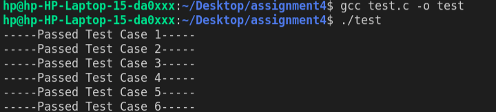
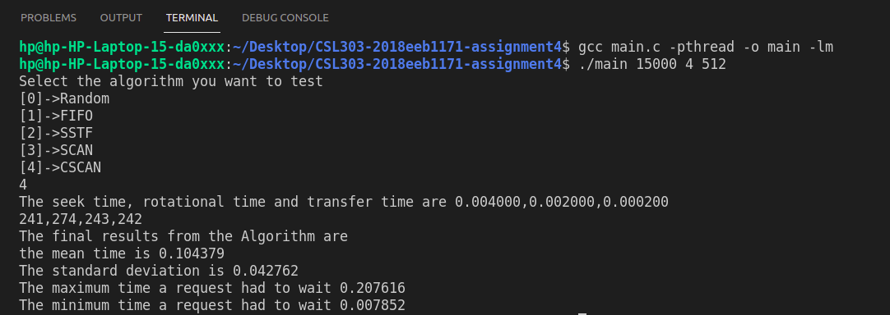
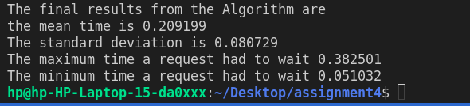

# CS-303 Assignment 4

=================================

Submitter name: Preetesh Verma

Roll No.:2018eeb1171

Course: Operating System

=================================


## Problem Statement

As part of this assignment we need to develop a simulation program in C on linux that implements the simulation of the read, write and seek operations of a disk. These operations can be simulated by functions that just return the time (in ms) required to service each request. The program has to be developed in C programming language on a Linux OS.

The problem statement had the following main components:
1. Request Generator
2. Dispatcher

Thus, the problem statement asked us to create a scenario to mimic the disk scheduling which occurs and to compare the various algorithms for the same. For this we would be asking for certain sectors of disks as requests. This would lead to the formation of a sequence of requests of different tracks and then given the revolution speed, seek time, transfer time we could compute the response time for each request and therefore compare the results from the various algorithms.

## Approach to Solution

### Overview
First I am taking the arguments from the user and then calculating the rotational latency and transfer delay for the given arguments.
Thereafter I am generating random requests with the given parameters <platter,cylinder,sector,number_of_sector>. The dispatcher then takes up this request array and as per the algorithm selected by the user it assigns it to a particular algorithm function where the total response time is computed using Seek time+Rotational delay+Transfer Time. The results are then computed on this value. 
I have implemented the algorithms:

1. Random
2. FIFO
3. SSTF
4. SCAN
5. CSCAN

The results pertaining to the above algorithms can be found at the bottom.

### Directory Structure

```

|-- README.md
|-- main.c
|-- test.c
|-- Readme.pdf
|-- images
|-- |-- figure.png..

```

### Detailed Explanation of the solution and contents of each file

### main.c
This is the main file which starts the program. The file takes the following arguments upon execution and if not provided the server would not start.

1. Revolution Speed.
2. Seek Time
3. Sector Size
4. Type Of Algorithm

Seek Time:Seek time is the time taken to locate the disk arm to a specified track where the data is to be read or write. So the disk scheduling algorithm that gives minimum average seek time is better.

Rotational Latency: Rotational Latency is the time taken by the desired sector of disk to rotate into a position so that it can access the read/write heads. So the disk scheduling algorithm that gives minimum rotational latency is better.

Transfer Time: Transfer time is the time to transfer the data. It depends on the rotating speed of the disk and number of bytes to be transferred.

Upon receiving the above mentioned arguments the programs starts by creating the memory blocks and initializing the space for OS and marking the rest of the space as free.
For the memory blocks each partition has been implemented as a linked list with the following structures.

```

struct request {
    int platter_number;
    int track_number;
    int sector_begin;
    int sector_count;
    clock_t start;
};
 
```
After generating a fixed amount of requests the dispatcher then on the selection of algorithm sends the requests to the respective functions after segregating the requests based on their platter number. After the computation of the requests the results are pushed into a queue where results are computed and printed later.


### test.c

This is the file contating the unit tests written by me to test the functions.
The tests check the working of the heuristic,multithreading functions.
The test cases basically run tests on heuristic operations such as sorting.
The random generation of request for each type of resource.
Proper allocation of items to a request if available.
The use of pthread library to create threads.

## Procedure to run the files

To run the solution only one file needs to run.
main.c is the file containing the entire codebase.

Commands to compile and run the main.c and a standard argument list which could be changed by the user are provided below.

```
gcc main.c -pthread -o main
./main 7500 4 512
```

Then provide the arguments as needed by the function.

```
Select the algorithm you want to test
[0]->Random
[1]->FIFO
[2]->SSTF
[3]->SCAN
[4]->CSCAN
1 
```

Commands to run the unit test file code

```
gcc test.c -o test
./test
```




### Snapshots of the results

Main program asking for arguments


Main program running


A demo video can be found in the images folder
## Results

| Input | Scheduling Policy | Avg | Min | Max |Std Dev   | Throughput  |                                       
|---|---|---|---|---|---|---|
|7500,512,4 |Random |0.355984   |0.013262   |0.375196   |0.282208   |2857   |
|15000,512,4|Random |0.204684   |0.008831   |0.221618   |0.160234   |5000   |
|7500,512,4 |FIFO   |0.209739   |0.051215   |0.383454   |0.080738   |4784   |
|15000,512,4|FIFO   |0.123878   |0.033800   |0.223374   |0.041991   |8333   |
|7500,512,4 |SSTF   |0.177608   |0.026491   |0.329314   |0.083637   |5649   |
|15000,512,4|SSTF   |0.091993   |0.017854   |0.192001   |0.042834   |10818  |
|7500,512,4 |SCAN   |0.191820   |0.034544   |0.335524   |0.082973   |5235   |
|15000,512,4|SCAN   |0.106322   |0.026080   |0.175209   |0.042573   |9433   |
|7500,512,4 |CSCAN  |0.191395   |0.034820   |0.343871   |0.083431   |5238   |
|15000,512,4|CSCAN  |0.105653   |0.026091   |0.182876   |0.042835   |9488   |

RANDOM
Useful benchmark to test other algorithms.Used for simulations

FCFS
Advantages:
Every request gets a fair chance
No indefinite wait
Disadvantages:
Large seek time

SSTF--  Advantages:
Average Response Time decreases
Throughput increases
Disadvantages:
Overhead to calculate seek time in advance
Can cause Starvation for a request
High standard deviation of response time as SSTF favours only some requests

SCAN
Advantages:
High throughput
Standard deviation in response time is low
Average response time is low
Disadvantages:
Long waiting time for requests for locations just visited by disk arm

CSCAN
Advantages:
Compared to SCAN provides more uniform wait time.

Thus in terms of time SSTF provides the best results.
## References
https://www.geeksforgeeks.org/disk-scheduling-algorithms/